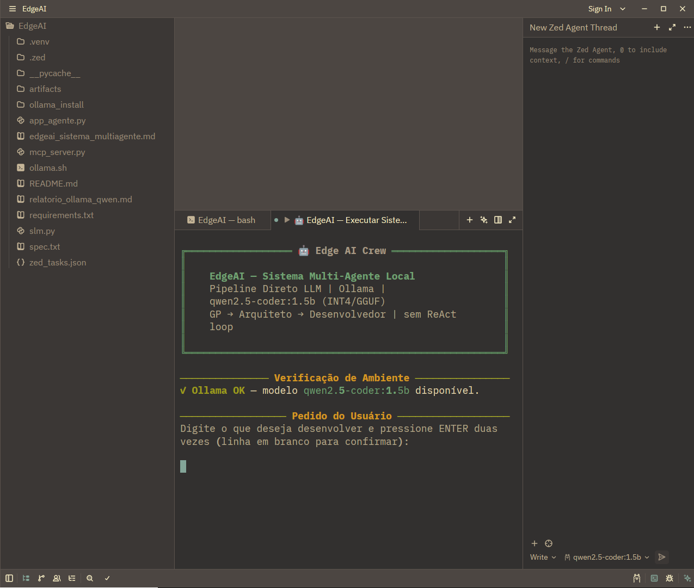
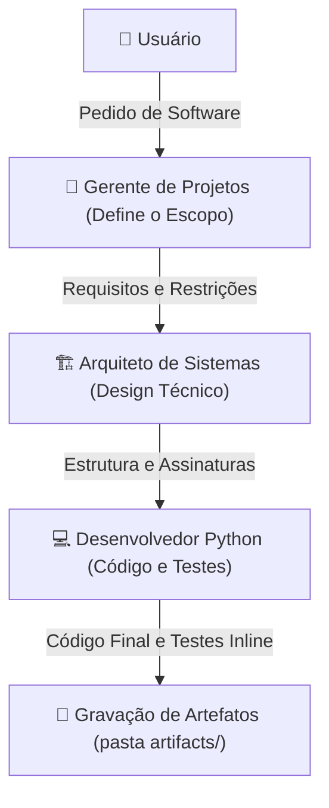

# 🤖 EdgeAI — Sistema Multi-Agente Local
### Projeto desenvolvido para o curso: **I2A2 - Agentic AI: uma introdução**

   


> **Pipeline multi-agente linear sequencial e servidor MCP otimizados para execução local em hardware Edge AI (Restrito/Low-End).**

---

## 📋 Índice
1. [Sobre o Projeto](#-sobre-o-projeto)
2. [Arquitetura do Sistema](#%EF%B8%8F-arquitetura-do-sistema)
3. [Histórico Arquitetural: O Pivô do Loop Dinâmico](#-hist%C3%B3rico-arquitetural-o-piv%C3%B4-do-loop-din%C3%A2mico)
4. [Hardware Alvo e Defesas Contra Bloat](#-hardware-alvo-e-defesas-contra-bloat)
5. [Estrutura do Projeto](#-estrutura-do-projeto)
6. [Instalação e Configuração](#-instala%C3%A7%C3%A3o-e-configura%C3%A7%C3%A3o)
7. [Como Executar](#-como-executar)
8. [Integração com a IDE Zed](#-integra%C3%A7%C3%A3o-com-a-ide-zed)
9. [Matriz de Compatibilidade](#-matriz-de-compatibilidade)

---

## ℹ️ Sobre o Projeto

Projeto desenvolvido para o curso **I2A2 - Agentic AI: uma introdução**.

O **EdgeAI** é uma solução de engenharia de software projetada para rodar **sistemas multi-agentes de inteligência artificial de forma 100% local e offline**. Desenvolvido com foco no ecossistema local do **Ollama** e no modelo leve **Qwen2.5-Coder-1.5B**, o projeto simula uma tripulação de engenharia de software (Gerente de Projetos, Arquiteto e Desenvolvedor) para gerar soluções de código documentadas e testadas sem precisar de chaves de API pagas ou conexões de rede externas.

Adicionalmente, o projeto inclui um servidor **MCP (Model Context Protocol)** para integração direta como uma ferramenta (tool) na interface de chat do agente da IDE **Zed**.


## Assista ao vídeo:
[](https://www.youtube.com/watch?v=1Rb6H7dSKRw)
Este vídeo demonstra o uso do projeto.


---

## 🏗️ Arquitetura do Sistema

O fluxo de trabalho foi estruturado como um pipeline linear direto. Cada etapa é uma chamada direta (via LangChain / ChatOllama) que recebe apenas o resumo técnico purificado do agente anterior, mantendo a janela de contexto limpa e prevenindo crashs de memória.



### Personas dos Agentes

| Agente | Função no Pipeline | Diretriz do Prompt |
| :--- | :--- | :--- |
| **🎯 Gerente de Projetos (GP)** | Analisa o pedido do usuário e define os limites do projeto. | Documento conciso: requisitos funcionais, critérios de aceitação e restrições. |
| **🏗️ Arquiteto de Sistemas** | Cria o design técnico a partir do escopo do GP. | Assinaturas de funções, escolha do algoritmo e fluxo de dados (sem escrever código real). |
| **💻 Desenvolvedor Python** | Implementa o código Python completo baseado no design do Arquiteto. | Código limpo com type-hints, bloco `if __name__ == '__main__':` de teste e testes inline com veredito. |

---

## 🔄 Histórico Arquitetural: O Pivô do Loop Dinâmico

Originalmente, o projeto foi planejado utilizando o framework **CrewAI** com um processo hierárquico (`Process.hierarchical`) e loops dinâmicos de correção automática (se um teste inline falhasse, o GP enviaria o erro de volta ao Arquiteto/Desenvolvedor para retificar).

Durante os testes práticos no hardware restrito, foram identificados **três problemas críticos** ao usar modelos de pequeno porte (SLMs, especificamente o `qwen2.5-coder:1.5b` quantizado em INT4):
1. **Falha Sistemática no Protocolo ReAct**: Modelos menores de 3B parâmetros não conseguem seguir de forma consistente a lógica *Thought → Action → Observation* exigida pelo motor de agentes do CrewAI, resultando em erros de parser JSON ou loops intermináveis de execução (travados por até 27 minutos).
2. **Context Bloat (Inchaço de Contexto)**: O vai-e-vem dos loops dinâmicos acumulava o histórico no buffer do modelo, estourando rapidamente o limite físico de **4096 tokens**.
3. **VRAM Spillover**: O estouro do contexto forçava o transbordo da memória da GPU de 2GB para a memória RAM (CPU), paralisando o sistema.

**A Solução Implementada:**
A orquestração complexa do CrewAI foi substituída por um **pipeline sequencial direto via LangChain (`llm.invoke()`)**. Ao invés de manter um chat contínuo volumoso, o pipeline extrai e envia apenas o output final útil de cada etapa. Essa alteração técnica eliminou 100% dos erros de parsing, estabilizou o consumo de memória e permitiu que tarefas de geração de código fossem concluídas com sucesso em segundos.

---

## 💻 Hardware Alvo e Defesas Contra Bloat

O sistema foi otimizado para o seguinte perfil de máquina edge:

*   **Processador**: CPU x86_64 de 8 núcleos
*   **Memória RAM**: 8 GB totais (~4.2 GB disponíveis de uso livre)
*   **GPU Dedicada**: NVIDIA GeForce MX110 (2 GB VRAM)
*   **Sistema Operacional**: Ubuntu Linux

### Estratégias de Mitigação
Para rodar com estabilidade sem estourar o limite físico de hardware:

*   **Janela de Contexto Travada (`num_ctx=4096`)**: Impede o crescimento desordenado do cache KV na VRAM de 2GB.
*   **Limite Estrito de Geração (`num_predict=1500`)**: Evita respostas excessivamente longas ou loops recursivos infinitos do LLM.
*   **Temperatura Baixa (`temperature=0.1`)**: Prioriza a previsibilidade e a consistência das respostas de codificação.
*   **Controle de CPU/Thread (`num_thread=6`)**: Limita a execução do Ollama em 6 núcleos da CPU, garantindo que o sistema operacional permaneça responsivo (evita starvation).

---

## 📁 Estrutura do Projeto

```
EdgeAI/
├── app_agente.py             # Script principal: Pipeline multi-agente direto via LLM
├── mcp_server.py             # Servidor MCP para integração com o chat do Zed Agent
├── ollama.sh                 # Wrapper Bash para gerenciar e executar o Ollama localmente
├── requirements.txt          # Declaração das dependências do ecossistema Python
├── zed_tasks.json            # Configuração de Tasks customizadas para a IDE Zed
├── slm.py                    # Script de validação simples de inferência da API REST
├── edgeai_sistema_multiagente.md  # Detalhamento técnico da arquitetura multi-agente
├── relatorio_ollama_qwen.md   # Relatório técnico completo do setup local
├── artifacts/                # Diretório onde os artefatos das runs são salvos
│   ├── run_[timestamp]/      # Histórico individual de cada execução
│   │   ├── escopo.md
│   │   ├── arquitetura.md
│   │   ├── codigo.py
│   │   └── raciocinio.md
│   ├── escopo.md             # Cópia do último escopo gerado (latest)
│   ├── arquitetura.md        # Cópia da última arquitetura gerada (latest)
│   ├── codigo.py             # Cópia do último código gerado (latest)
│   └── raciocinio.md         # Cadeia de raciocínio completa consolidada (latest)
└── ollama_install/           # Diretório local do Ollama offline (binário, libs e modelos)
```

---

## 🔧 Instalação e Configuração

### 1. Preparar o Ambiente Python
Recomenda-se criar um ambiente virtual (venv) para isolar as dependências:

```bash
# Criar e ativar o ambiente virtual
python3 -m venv .venv
source .venv/bin/activate

# Instalar as dependências do projeto
pip install -r requirements.txt
```

### 2. Configurar o Ollama Localmente
Se você deseja utilizar a instalação manual offline provida na pasta do projeto:

```bash
# Tornar o script gerenciador executável
chmod +x ollama.sh

# Iniciar o servidor Ollama local em background
./ollama.sh serve

# Fazer o download do modelo Qwen2.5-Coder-1.5B
./ollama.sh run "Olá" # Ou deixe o script puxar os arquivos
# Nota: Você também pode usar a API nativa
./ollama_install/bin/ollama pull qwen2.5-coder:1.5b
```

> [!NOTE]
> Se preferir instalar o Ollama globalmente no sistema com privilégios administrativos (`sudo`), execute:
> `curl -fsSL https://ollama.com/install.sh | sudo sh`

---

## 🚀 Como Executar

### Modo Interativo
Inicie o script e insira a descrição da sua aplicação. O prompt aceita múltiplas linhas e será executado quando você pressionar a tecla `Enter` duas vezes (uma linha em branco).

```bash
python3 app_agente.py
```

### Modo Batch (Pipeline de Comando)
Você pode enviar a especificação diretamente via pipe (`stdin`), útil para integrações ou automação:

```bash
echo "Escreva uma calculadora em Python que suporte operações básicas e validação de divisão por zero." | python3 app_agente.py
```

---

## 🔌 Integração com a IDE Zed

### 1. Configurando Tasks Customizadas
Para ter atalhos rápidos de execução e gerência dentro da IDE Zed, importe as configurações para o diretório da IDE:

```bash
mkdir -p ~/.config/zed
cp zed_tasks.json ~/.config/zed/tasks.json
```

Abra a IDE Zed no projeto, aperte `Ctrl+Shift+P` (ou `Cmd+Shift+P` no macOS), busque por `Task: Spawn` e escolha uma das opções disponíveis:
*   `🤖 EdgeAI — Executar Sistema Multi-Agente`
*   `🔍 EdgeAI — Verificar Ambiente`
*   `📦 EdgeAI — Instalar Dependências`
*   `🚀 EdgeAI — Iniciar Ollama`
*   `⬇️ EdgeAI — Baixar Modelo`

### 2. Configurando o Servidor MCP (Model Context Protocol)
O arquivo `mcp_server.py` permite que o agente interno do Zed (IA integrada) utilize a sua tripulação local de agentes como uma ferramenta.

Para registrar o servidor MCP no seu Zed:
1. Abra as configurações globais do Zed (`Ctrl+,` ou `Settings`).
2. Adicione ou edite o bloco `context_servers` em seu `settings.json`:

```json
{
  "context_servers": {
    "edgeai-agents": {
      "command": "python3",
      "args": ["/home/vsvasconcelos/agents/EdgeAI/mcp_server.py"],
      "env": {
        "PYTHONUNBUFFERED": "1"
      }
    }
  }
}
```

3. Certifique-se de que a dependência `fastmcp` ou `mcp` está instalada no seu Python global ou venv em execução.
4. Agora, no chat do Zed Agent, você poderá invocar a ferramenta `rodar_pipeline_agentes` enviando um pedido de funcionalidade!

---

## 📊 Matriz de Compatibilidade

As versões abaixo foram homologadas e garantem o funcionamento correto do ecossistema:

| Tecnologia | Versão | Observação |
| :--- | :--- | :--- |
| **Python** | 3.14.4 / 3.x | Linguagem de execução padrão do pipeline |
| **Ollama** | v0.30.11 / v0.31.1 | Motor de inferência local rodando na porta 11434 |
| **Qwen2.5-Coder** | 1.5B (INT4) | Modelo de linguagem local alvo |
| **CrewAI** | v0.11.2 | Legado de arquitetura (não utilizado no pipeline ativo) |
| **LangChain** | Versão resolvida | Biblioteca base de interação com ChatOllama |
| **FastMCP** | 0.x | SDK para encapsulamento das ferramentas MCP |

---

> [!TIP]
> Todos os códigos Python gerados pelo desenvolvedor local são salvos automaticamente em formato bruto no arquivo `artifacts/codigo.py`, pronto para execução e testes imediatos.
