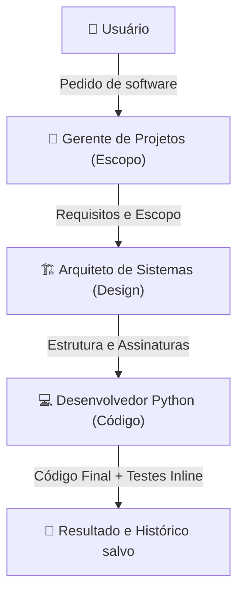

# 🤖 EdgeAI — Sistema Multi-Agente Local

> Pipeline multi-agente linear sequencial otimizado para hardware Edge AI local.

## Entregáveis Gerados

| Arquivo | Descrição |
|---|---|
| [app_agente.py](file:///home/vsvasconcelos/agents/EdgeAI/app_agente.py) | Script principal — pipeline direto via LLM (sem loops/ReAct) |
| [requirements.txt](file:///home/vsvasconcelos/agents/EdgeAI/requirements.txt) | Dependências do ecossistema |
| [zed_tasks.json](file:///home/vsvasconcelos/agents/EdgeAI/zed_tasks.json) | Configuração da IDE Zed (tasks.json) |

---

## Histórico de Decisão Arquitetural: O Pivô do Loop Dinâmico

A concepção inicial do projeto previa uma topologia de tripulação (`CrewAI`) em processo hierárquico, onde o Gerente de Projetos (GP) coordenaria o Arquiteto e o Desenvolvedor, validando as entregas e reabrindo loops dinâmicos de correção em caso de falhas.

No entanto, testes práticos no hardware alvo com o modelo local **`qwen2.5-coder:1.5b` (INT4)** mostraram que:
1. **Falha no Protocolo ReAct:** Modelos de pequeno porte (SLMs, ≤3B) não conseguem seguir de maneira consistente a lógica de *Thought → Action → Observation* exigida pelo `AgentExecutor` do CrewAI. Isso resultava em erros de parse de JSON e travamentos do executor.
2. **Context Bloat e estouro de VRAM:** As idas e vindas de um loop dinâmico de revisão acumulavam tokens rapidamente, estourando a janela de contexto de **4096 tokens** e forçando o transbordo para a CPU, paralisando a inferência local.
3. **Loops Infinitos:** O modelo entrava com facilidade em loops de repetição infrutíferos (por exemplo, 27 minutos sem produzir código ou progresso).

**A Solução de Contorno:** 
O sistema foi simplificado para um **pipeline linear direto (GP → Arquiteto → Desenvolvedor)** implementado via chamadas diretas (`llm.invoke()`) utilizando prompts de sistema especializados. Essa arquitetura removeu o framework de execução do CrewAI e a lógica de loop automatizada, alcançando 100% de estabilidade de inferência e garantindo que o modelo produza resultados rápidos e úteis em segundos.

---

## Hardware Alvo

| Recurso | Especificação |
|---|---|
| CPU | 8 núcleos |
| RAM | 8 GB total / ~4.2 GB livres |
| GPU | NVIDIA GeForce MX110 — 2 GB VRAM |
| OS | Ubuntu Linux |
| Motor | Ollama local — porta 11434 |
| Modelo | `qwen2.5-coder:1.5b` (INT4, GGUF) |
| Modo inferência | Híbrido 33% CPU / 67% GPU |
| Contexto | **4096 tokens** (travado) |
| Throughput | ~9.5 tokens/s |

---

## Arquitetura do Sistema

O sistema opera como um pipeline sequencial no qual cada agente executa sua tarefa e o resultado alimenta o prompt do próximo agente, mantendo o contexto limpo e conciso.



### Personas Simuladas (Agentes)

| Agente | Função no Pipeline | Diretrizes Principais |
|---|---|---|
| **Gerente de Projetos (GP)** | Analisa o pedido inicial e cria o documento de escopo. | Conciso, foca nos requisitos funcionais e restrições. |
| **Arquiteto de Sistemas** | Define assinaturas de funções e o fluxo de dados técnico. | Não escreve código funcional; desenha a estrutura do algoritmo. |
| **Desenvolvedor Python** | Implementa o código com type-hints e testes unitários inline simulados. | Responde estritamente com código executável e os blocos de teste. |

### Pipeline de Tarefas

```
[Pedido do Usuário] ──► GP (Escopo) ──► Arquiteto (Design) ──► Desenvolvedor (Código + Testes) ──► [Gravação dos Artefatos]
```

---

## Defesas Contra Crash de VRAM e Travamentos

> [!IMPORTANT]
> O maior risco em Edge AI com LLMs locais executando no hardware alvo é o **context bloat**: o acúmulo excessivo de tokens no histórico, que força o transbordo para a CPU e pode congelar o sistema.

| Defesa | Implementação | Justificativa |
|---|---|---|
| **Pipeline Sequencial Linear** | Substituição do ReAct loop por passagens diretas de strings | Remove loops dinâmicos infinitos e o consumo excessivo de histórico |
| **Limitação de Contexto** | `num_ctx=4096` no `ChatOllama` | Evita que o KV cache expanda além do limite seguro da VRAM |
| **Limite de Resposta** | `num_predict=1500` (max_tokens) | Evita respostas prolixas e loops intermináveis do LLM |
| **Baixa Temperatura** | `temperature=0.1` | Respostas altamente determinísticas e curtas |
| **Limpeza de Contexto** | Passagem seletiva de informações | Em cada etapa, apenas a saída limpa do agente anterior é enviada, em vez de logs completos de execução |
| **Alocação de Threads** | `num_thread=6` | Deixa 2 núcleos livres para o sistema operacional evitar starvation |


---

## Como Usar

### 1. Pré-requisitos

```bash
# Verificar Ollama
ollama serve &
ollama pull qwen2.5-coder:1.5b

# Instalar dependências Python
pip install -r requirements.txt --user
```

### 2. Executar o sistema

```bash
cd /home/vsvasconcelos/agents/EdgeAI
python3 app_agente.py
```

### 3. Modo Batch (via pipe)

```bash
echo "Crie um sistema de monitoramento de temperatura em Python." | python3 app_agente.py
```

---

## Configuração da IDE Zed

```bash
# Se não existe tasks.json:
cp /home/vsvasconcelos/agents/EdgeAI/zed_tasks.json ~/.config/zed/tasks.json
```

**Para disparar**: `Ctrl+Shift+P` → "Task: Spawn" → selecione a task.

### Tasks disponíveis no Zed

| Label | Ação |
|---|---|
| 🤖 EdgeAI — Executar Sistema Multi-Agente | Inicia `app_agente.py` com TTY alocado |
| 🔍 EdgeAI — Verificar Ambiente | Health check: Ollama + Python + CrewAI |
| 📦 EdgeAI — Instalar Dependências | `pip install -r requirements.txt` |
| 🚀 EdgeAI — Iniciar Ollama | `ollama serve` em terminal dedicado |
| ⬇️ EdgeAI — Baixar Modelo | `ollama pull qwen2.5-coder:1.5b` |
| ⚡ EdgeAI — Executar em Modo Batch | Execução com pedido pré-definido via pipe |

---

## Compatibilidade de Versões

| Componente | Versão | Observação |
|---|---|---|
| Python | 3.14.4 | Instalado no sistema |
| crewai | 0.11.2 | Instalado para a arquitetura inicial (não utilizado no pipeline direto final) |
| langchain-community | - | Utilizado para conexão direta com o ChatOllama |
| Ollama | 0.31.1 | Expõe endpoint local na porta 11434 |

> [!NOTE]
> O `crewai` permanece listado nas dependências e verificações como parte do histórico do projeto (projeto inicial), porém a execução atual é realizada de forma robusta e direta via LangChain/ChatOllama para evitar instabilidades de loops e ReAct.

